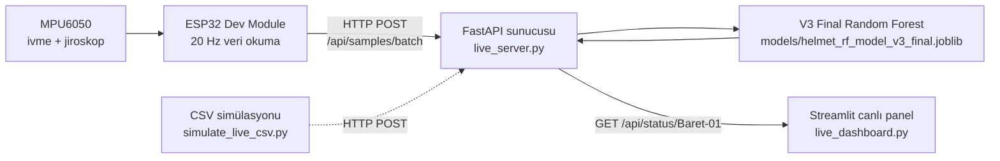

# ET-HACKTHON
[🇹🇷 Türkçe](README.md) | [🇬🇧 English](README_EN.md)

---

# Akıllı Baret Canlı Takip Sistemi

Akıllı Baret, inşaat ve iş güvenliği bağlamında baretin anlık kullanım durumunu kamera kullanmadan takip eden bir prototiptir. Sistem, MPU6050 ivmeölçer ve jiroskop verilerini ESP32 üzerinden Wi-Fi ile FastAPI sunucusuna gönderir; V3 Final Random Forest modeli tahmin üretir ve Streamlit canlı paneli yöneticinin durumu izlemesini sağlar.

Ana ürün canlı takip akışıdır; `app.py` dosyası CSV yükleme tabanlı offline/demo paneli olarak tutulmuştur.

## Problem ve Çözüm

Sahada baretin gerçekten kafada olup olmadığını kamera ile izlemek mahremiyet, maliyet ve ortam koşulları açısından sorunlu olabilir. Bu prototip, baret üzerindeki IMU sensöründen alınan hareket ve yönelim verilerini kullanarak dört durumu sınıflandırır:

| Model sınıfı | Türkçe anlamı |
| --- | --- |
| `On Head` | Baret Kafada |
| `On Belt` | Baret Kemerde / Belde |
| `In Hand` | Baret Elde |
| `On Surface` | Baret Yüzeyde |

## Öne Çıkan Özellikler

- Kamera kullanmadan IMU tabanlı durum tespiti
- ESP32 ile canlı Wi-Fi veri akışı
- FastAPI tabanlı AI tahmin sunucusu
- Streamlit canlı yönetici paneli
- 2 saniyelik tahmin penceresi ve yaklaşık 1 saniyelik güncelleme
- Donanım yokken CSV ile canlı akış simülasyonu
- Offline CSV demo paneli

## Canlı Sistem Mimarisi



## Donanım

- ESP32 Dev Module
- MPU6050
- 3.7 V 500 mAh Li-Po pil
- TP4056 şarj/koruma modülü
- XL6009 ayarlanabilir DC-DC boost dönüştürücü
- Açma-kapama anahtarı
- Geliştirme sırasında CSV kayıtları almak için microSD modülü

microSD modülü, veri toplama/model geliştirme aşamasında CSV kayıtları için kullanılmıştır. Final canlı takip akışında sensör verileri Wi-Fi üzerinden sunucuya iletildiği için microSD modülü zorunlu değildir.

## ESP32 ve MPU6050 Kablolama

| MPU6050 pini | ESP32 pini |
| --- | --- |
| VCC | 3V3 |
| GND | GND |
| SDA | GPIO21 |
| SCL | GPIO22 |

## Güç Sistemi

Final taşınabilir prototipte 3.7 V 500 mAh Li-Po pil, TP4056 şarj/koruma modülü, açma-kapama anahtarı ve XL6009 ayarlanabilir boost dönüştürücü fiziksel olarak entegre edilmiştir. XL6009 çıkışı multimetre ile 5.00 V seviyesine ayarlanmış ve boost çıkışı ESP32'nin `VIN / 5V` girişine verilmiştir.

Pil tabanlı canlı sistem doğrulamasının ayrıca kayıt altına alınması önerilir. Önceki canlı doğrulama akışlarında USB/powerbank besleme de kullanılmıştır.

```text
3.7 V 500 mAh Li-Po Pil
        ↓
TP4056 Şarj / Koruma Modülü
        ↓
Açma / Kapama Anahtarı
        ↓
XL6009 Boost Dönüştürücü — 5.00 V çıkışa ayarlı
        ↓
ESP32 VIN / 5V
        ↓
MPU6050 verilerinin Wi-Fi üzerinden canlı sunucuya iletilmesi
```

Güvenlik notları:

- XL6009 çıkışı ESP32'ye bağlanmadan önce multimetre ile 5.00 V'a ayarlanmalıdır.
- XL6009 çıkışı `ESP32 3V3` pinine bağlanmaz; yalnızca `VIN / 5V` girişine verilir.
- ESP32 haricî 5 V besleme ile çalışırken aynı anda USB üzerinden beslenmemelidir.
- TP4056 üzerinden şarj yapılırken prototipin kapalı tutulması önerilir.
- Bu prototip, sertifikalı bir iş güvenliği cihazı veya sertifikalı KKD yerine geçmez.

## Veri Toplama ve Sınıflar

Ham ve test sensör verileri `data/` altında tutulur. Canlı sistem için beklenen sensör kolonları:

```text
time_ms, acc_x, acc_y, acc_z, gyro_x, gyro_y, gyro_z, temp_c
```

Etiketli eğitim/test CSV dosyalarında ek olarak `label` kolonu bulunur. Model, tahmin sırasında `label` kolonunu kullanmaz.

`data/raw/helmet_data.csv`, ilk gerçek kayıtların birleştirilmiş eğitim çıktısıdır. `data/raw/helmet_data_pilot.csv` ise geliştirme sürecindeki pilot kayıt olarak tutulur. Ana sınıf CSV dosyaları (`on_head_01`, `on_belt_01`, `in_hand_01`, `on_surface_01`) ham veri yapısını göstermek ve yeniden eğitim izlenebilirliğini korumak için repoda bırakılmıştır.

## Model Geliştirme Sonuçları

| Aşama | Değerlendirme türü | Sonuç | Not |
| --- | --- | ---: | --- |
| V1 Baseline | Bağımsız test | %91,31 | İlk bağımsız test seti |
| V2 Orientation Test | Yeni bağımsız yönelim testi | %70,55 | Sol kemerde taşınan baret büyük ölçüde `In Hand` ile karıştı |
| V3 Final Model | İç kontrol | %95,89 | Sağ/sol kemer varyasyonları dahil tüm mevcut gerçek verilerle eğitildi |

Değerlendirme protokolü notu: V1 aşamasındaki `data/test/` verileri, V1 bağımsız testinden sonra sonraki model geliştirmesinde eğitim verisine dahil edilmiştir. V2 aşamasındaki `data/test2/` verileri de yönelim etkisini gösteren bağımsız testten sonra V3 eğitimine dahil edilmiştir. Bu nedenle V1 %91,31 ve V2 %70,55 değerleri kendi ölçüm anları için bağımsız test sonuçlarıdır.

V3 için yeni bağımsız final test yapılmamıştır. Bu nedenle %95,89 değeri bağımsız nihai doğruluk olarak değil, yalnızca iç kontrol sonucu olarak yorumlanmalıdır.

## Kurulum

Windows PowerShell örneği:

```powershell
python -m venv .venv
.\.venv\Scripts\Activate.ps1
pip install -r requirements.txt
```

Arduino Wi-Fi ayarı:

```powershell
Copy-Item arduino\akilli_baret_canli_wifi\secrets.example.h arduino\akilli_baret_canli_wifi\secrets.h
```

Ardından `arduino/akilli_baret_canli_wifi/secrets.h` dosyasında kendi Wi-Fi adınızı, şifrenizi ve bilgisayar IP adresinizi yazın. `secrets.h` GitHub'a dahil edilmez.

FastAPI sunucusunu başlatın:

```powershell
uvicorn live_server:app --host 0.0.0.0 --port 8000
```

Canlı paneli başlatın:

```powershell
streamlit run live_dashboard.py --server.port 8502
```

## Donanım Olmadan Simülasyon

Sunucu çalışırken demo CSV akışını ESP32 akışı gibi göndermek için:

```powershell
python simulate_live_csv.py --delay 1
```

Hızlı test için:

```powershell
python simulate_live_csv.py --delay 0.01
```

## Offline CSV Demo Paneli

CSV dosyasını elle yükleyerek demo tahmin yapmak için:

```powershell
streamlit run app.py
```

Bu panel ana ürün değildir; canlı sistemin yanında offline analiz ve demo aracı olarak tutulmuştur.

## Klasör Yapısı

```text
.
├── README.md
├── LICENSE
├── .gitignore
├── requirements.txt
├── app.py
├── live_server.py
├── live_dashboard.py
├── simulate_live_csv.py
├── arduino/
│   └── akilli_baret_canli_wifi/
│       ├── akilli_baret_canli_wifi.ino
│       └── secrets.example.h
├── ml/
├── models/
│   └── helmet_rf_model_v3_final.joblib
├── data/
│   ├── raw/
│   ├── test/
│   ├── test2/
│   ├── training_extra/
│   └── demo_input/
├── results/
│   ├── v1_baseline/
│   ├── v2_orientation_test/
│   ├── v3_final_model/
│   └── live_demo/
├── docs/
│   ├── architecture.md
│   ├── hardware-setup.md
│   ├── model-development.md
│   ├── live-system-setup.md
│   └── images/
└── CLEANUP_REPORT.md
```

`data/processed/`, `data/demo_output/` ve `archive_local/` GitHub dışı bırakılır.

## Fiziksel Prototip

### Final Taşınabilir Prototip

Kask üzerine entegre edilen final prototipte ESP32, MPU6050 ve taşınabilir güç birimleri birlikte kullanılmaktadır. Sensör verileri ESP32 tarafından Wi-Fi üzerinden canlı AI sunucusuna iletilmektedir.


### İç Güç Modülü Yerleşimi

Kaskın iç kısmına yerleştirilen XL6009 boost dönüştürücü, Li-Po tabanlı güç hattından alınan gerilimi ESP32 için ayarlanmış 5.00 V seviyesine yükseltmektedir.


### Önceki USB/Powerbank Tabanlı Canlı Prototip

Kamera kullanılmadan yapılan canlı takip prototipinde, ESP32 ve MPU6050 modülleri baret üzerine deneysel olarak sabitlenmiştir. MPU6050 hareket/yönelim verilerini toplar; ESP32 ise bu verileri Wi-Fi üzerinden canlı AI sunucusuna iletir. Görselde USB güç bağlantısı bulunmaktadır; önerilen Li-Po + TP4056 + 5 V boost mimarisinin uygulanmış hali olarak yorumlanmamalıdır.


### Canlı Donanım Yakın Görünümü

Canlı takip sürümünde kullanılan ESP32 ve MPU6050 bağlantısının yakın görünümü. Bu deneysel prototip montajında veriler Wi-Fi üzerinden aktarıldığından microSD modülü canlı kullanım için gerekli değildir.


### Veri Toplama Aşamasındaki Donanım

Modelin geliştirilmesi sırasında sensör kayıtlarını CSV olarak oluşturabilmek için microSD modülü kullanılmıştır. Bu aşamada toplanan gerçek hareket verileri, dört sınıflı Random Forest modelinin eğitimi ve değerlendirilmesi için kullanılmıştır. Canlı takip sürümünde sensör verileri Wi-Fi üzerinden doğrudan sunucuya iletildiği için microSD modülü zorunlu değildir.


## Canlı Sistem Doğrulaması

### Gerçek Donanım Akışı ile Canlı Panel

ESP32 ve MPU6050 tarafından gönderilen gerçek sensör paketleri FastAPI sunucusunda işlenmiş ve tahminler Streamlit canlı takip panelinde görüntülenmiştir.


## Ekran Görüntüleri

### Canlı Akış Simülasyonu Paneli

Kayıtlı gerçek sensör verilerinin canlı akış simülasyonu sırasında FastAPI sunucusuna aktarılması ve Streamlit panelinde anlık durum değişimlerinin izlenmesi:


### Offline Çoklu Durum Demo Paneli

Etiketsiz senaryo CSV dosyasının `app.py` arayüzünde analiz edilmesi:


V1 bağımsız test confusion matrix:


V2 yönelim testi confusion matrix:


V3 iç kontrol confusion matrix:


## Bilinen Sınırlamalar

- Yönelim değişimi model performansını etkileyebilir.
- V3 için yeni bağımsız final test yapılmamıştır.
- Gerçek saha koşulları için daha geniş kişi, hareket, yönelim ve ortam verisi gerekir.
- Canlı API yerel prototip ağı için tasarlanmıştır ve şu an kimlik doğrulama içermez.
- Canlı süre/geçmiş bilgisi sunucu belleğinde tutulur; sunucu yeniden başlayınca sıfırlanır.
- Tam çoklu baret yönetim paneli henüz geliştirme adımıdır; mevcut panel `Baret-01` prototipini gösterir.
- Prototip, sertifikalı kişisel koruyucu ekipman veya resmi iş güvenliği denetimi yerine geçmez.

## Gelecek Geliştirmeler

- Daha kompakt özel PCB tasarımı
- Daha küçük ve verimli güç modülü
- Pil seviye izleme
- Raspberry Pi veya yerel ağ merkezi ile sahada bağımsız çalışma
- Çoklu baret desteğini genişletmek
- Düşme veya çarpma olayı tespiti eklemek
- Veri yedekleme ve uzun dönem raporlama

## Güvenlik ve Etik

Sistem kamera kullanmadığı için çalışan mahremiyeti açısından avantaj sağlar. Buna rağmen prototip, iş güvenliği kararlarında tek başına kesin kanıt veya sertifikalı denetim aracı olarak kullanılmamalıdır.

## Lisans

Bu proje MIT lisansı ile yayınlanır. Ayrıntılar için `LICENSE` dosyasına bakın.
